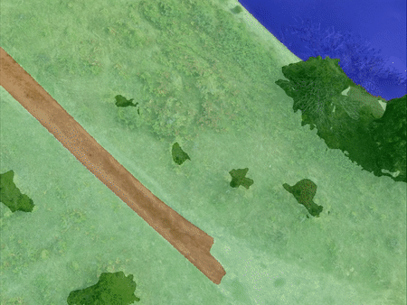

# Data Augmentation for Aerial Images

[[`Paper`](https://ieeexplore.ieee.org/document/10461075)] [[`Dataset`](https://forms.office.com/e/7e3RnXfKJD)]

**Generated images from WildUAV - novel views**




**Generated semantic images from UAVid - intermediate frames**


-----


This repository contains links for the generated **RGB**, **semantic** and **depth** images using the WildUAV (florea2021wilduav) and UAVid (LYU2020108) datasets.
These new images were obtained using the method proposed in the paper **Data Augmentation for Environment Perception with Unmanned Aerial Vehicles**.

Before downloading and using this data please read [license.pdf](license.pdf) and make sure your use follows the license terms.

The data itself can be accessed at [this link](https://forms.office.com/e/7e3RnXfKJD). 
(The UAVid depth images will be added soon)

If you use or find our dataset useful, please cite the associated [paper](https://ieeexplore.ieee.org/document/10461075)
:link::


```bibtex
@ARTICLE{chiciudean2024data,
  author={Chiciudean, Vivian and Florea, Horatiu and Blaga, Bianca-Cerasela-Zelia and Beche, Radu and Oniga, Florin and Nedevschi, Sergiu},
  journal={IEEE Transactions on Intelligent Vehicles}, 
  title={Data Augmentation for Environment Perception with Unmanned Aerial Vehicles}, 
  year={2024},
  pages={1-15},
  doi={10.1109/TIV.2024.3374117}}
```

-----

The images from which we obtain the WildUAV_aug and WildUAV_aug_sdiv datasets comes from the authors of **WildUAV** (florea2021wilduav), accesible at [https://github.com/hrflr/wuav](https://github.com/hrflr/wuav):link:.
```bibtex
@article{florea2021wilduav,
  title={WildUAV: Monocular UAV Dataset for Depth Estimation Tasks},
  author={Florea, Horatiu and Miclea, Vlad-Cristian and Nedevschi, Sergiu},
  journal={2021 IEEE 17th International Conference on Intelligent Computer Communication and Processing (ICCP)},
  year={2021},
  organization={IEEE}
}
```

The video sequences and semantic images from which we obtain the UAVid_aug and UAVid_aug_sdiv datasets comes from the authors of UAVid (LYU2020108), accesible at [https://uavid.nl/](https://uavid.nl/):link:.
```bibtex
@article{LYU2020108,
	author = "Ye Lyu and George Vosselman and Gui-Song Xia and Alper Yilmaz and Michael Ying Yang",
	title = "UAVid: A semantic segmentation dataset for UAV imagery",
	journal = "ISPRS Journal of Photogrammetry and Remote Sensing",
	volume = "165",
	pages = "108 - 119",
	year = "2020",
	issn = "0924-2716",
	doi = "https://doi.org/10.1016/j.isprsjprs.2020.05.009",
	url = "http://www.sciencedirect.com/science/article/pii/S0924271620301295",
}
```

### Description

A detailed explanation of how these images were generated can be found [here](link_to_paper):link:.

## Data contents

The [datasets.txt](datasets.txt) file lists the number of images in each dataset directory.
The shared directory contains separate folders for the **RGB**, **semantic** and **depth** images. 

> The directory structure:
```bash
    .
    ├── dataset                   # (e.g., WildUAV_aug/WildUAV_aug_sdiv/UAVid_aug/UAVid_aug_sdiv)
    │   ├── sequence              # (e.g., seq00 for WildUAV/seq13 for UAVid)      
    │   │   ├── depth             # the generated depth images
    │   │   ├── norm-depth        # normalized depth image, for visualisation only
    │   │   ├── rgb               # the generated RGB(texture) images
    │   │   └── semantic          # the generated semantic images
    │   └── ...                   
    └── ...         
```

## Semantic classes

The semantic classes respect the official version from the corresponding datasets, to which the class **(254,254,254)** is added. 
This class represents the areas that did not receive semantic information in the process of building the semantic mesh, as well as the real-world areas that are not covered by the 3D mesh reconstruction.

## Data format

The **RGB**(texture) and **semantic** images use **24 bits** for the color representation.
The **depth** images use **16 bits** (uint16/short) and the metric depth can be obtained using the following formula (same as Kitti Depth):
```
  IF (depth(i,j) != 0)
    THEN metric_depth(i,j) = ((float)depth(i,j))/256.0
    ELSE invalid depth
  ENDIF;
```
A 0 value indicates an invalid pixel (i.e., no ground truth/mesh surface exists).
Otherwise, the depth for a pixel can be computed in meters by converting the short value to float and dividing it by 256.0.

-----
The images are provided as PNG files, with a resolution of 5280 x 3956 for WildUAV and 4096 x 2160 for UAVid. 

The RGB images for WildUAV were initially generated at a resolution of 1320 x 989, due to an OpenGL limitation, and then rescaled to 5280 x 3956 with a bicubic interpolation (4 x 4 pixel neighborhood).

## Copyright

The published data is copyright by us and published under the Creative Commons Attribution-NonCommercial-ShareAlike 4.0 License, accesible at [this link](https://creativecommons.org/licenses/by-nc-sa/4.0/):link:. This means that you must attribute the work in the manner specified by the authors, you may not use this work for commercial purposes and if you alter, transform, or build upon this work, you may distribute the resulting work only under the same license.

